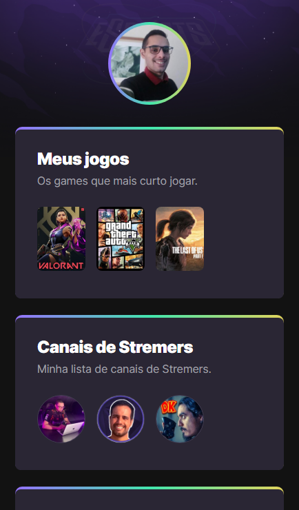

# NLW eSports - Trilha explorer

Projeto construido no evento next level week da Rocketseat

[click aqui para acessar](https://rafaelsantos360.github.io/NLWsports/)

## Tecnologias

-HTML
-CSS
-Git e Github

## O que aprendi

-HTML e CSS não são liguagens de programação, são linguagens de 
marcação e estilo.  
-Uma linguagem deve ter syntax, atributos e declaração correta. 
-Estruturar site com tags semanticas como header, section e main. 
-Colocar links em orden usando tags de lista ul e li. 
-Usar atributos de configuração gerais com tag *. 
-Usar atributos de margin, padding, border, backgrounds e gradiente. 
-Estruturar box-level usando flex e grid. 
-Usar class para modificações personalizadas. 
-Usar hover e nth-child para algumas interações com os itens. 
-Aplicar animações com Animation from, to.  

## Contato

santosdasilvarafael650@gmail.com